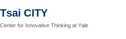

The Gong Lab is grateful for research and innovation support from the following organizations:

::: {.funding-grid}

:::

## Current & recent support

Our work has been supported through awards and collaborations including:

- **Yale Cancer Center** — Translational-Targeted Area of Research Excellence (T-TARE) and Catchment Area Research Awards
- **Yale New Haven Health** — Innovation Award for Clinical Trial Patient Matching
- **Tsai CITY at Yale** — Rothberg Catalyzer Prize, Summer Fellowship, and Student Catalyst Award
- **Blavatnik Fund for Innovation at Yale** — Accelerator Award for AI-powered clinical trial matching
- **Connecticut Innovations** — BioPipeline and CTNext Entrepreneur Innovation Awards
- **Eli Lilly** — Quality improvement initiatives in breast oncology
- **ASCO & Pfizer** — Clinical trial participation and biomarker testing research
- **Susan G. Komen Foundation** — AI-assisted navigation for hereditary breast cancer testing
- **NIH / National Library of Medicine** — AI-enabled integration of clinical trial registries and literature
- **U.S. Department of Defense** — Genetics and cascade testing research (ENGAGEMENT study)
