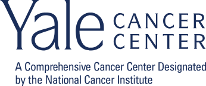
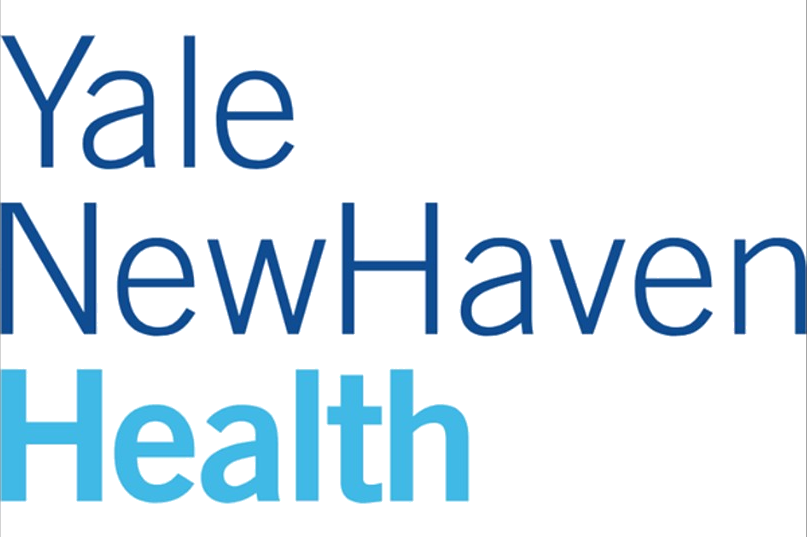
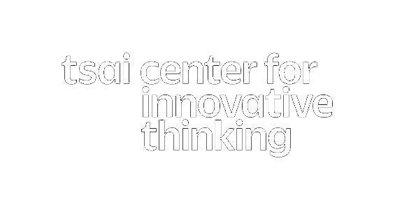
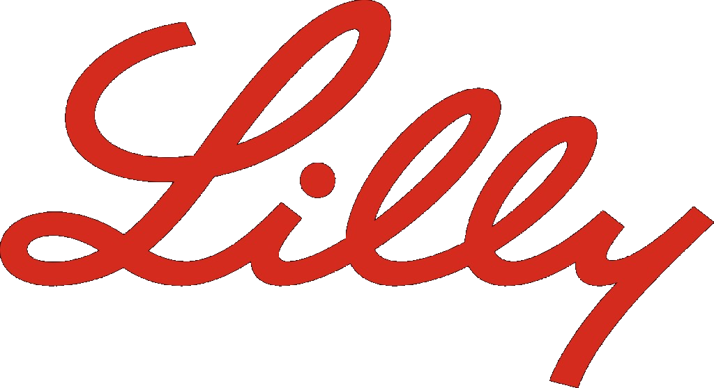
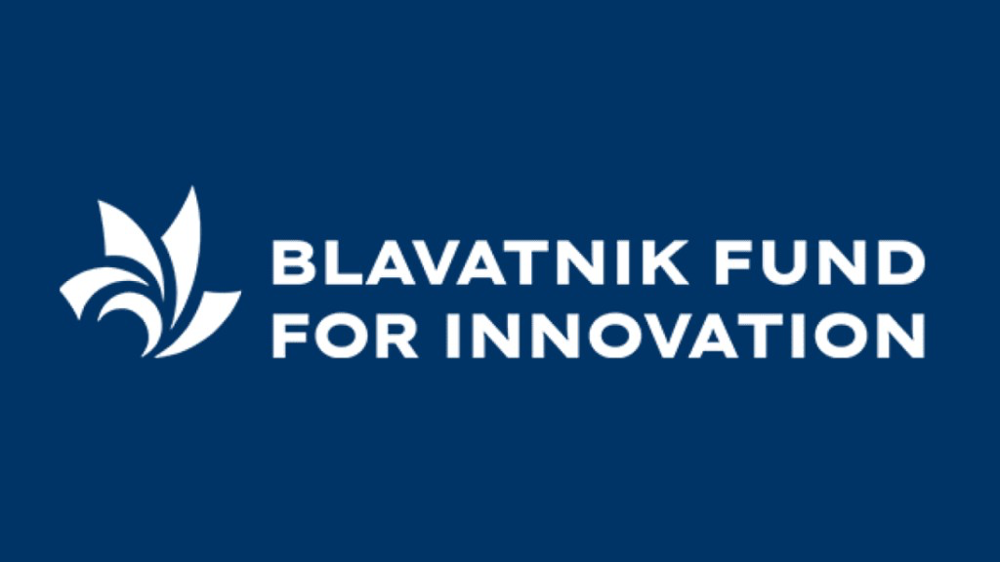
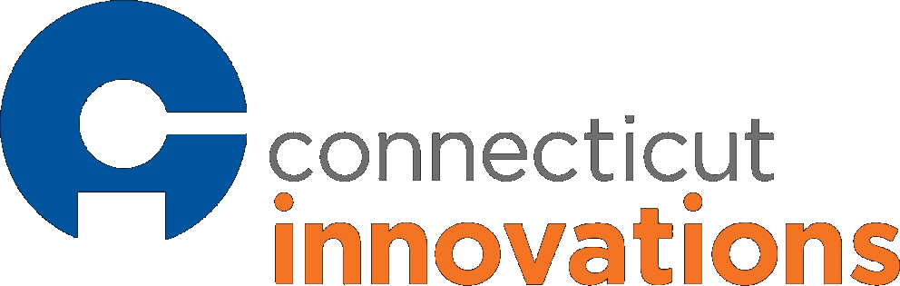
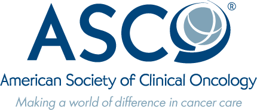
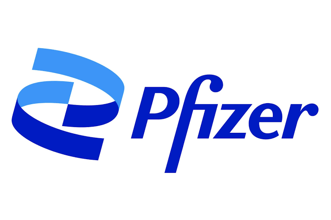
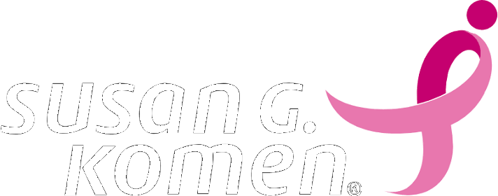

The Gong Lab is grateful for research and innovation support from the following organizations:

```{=html}
<div class="funding-grid">
  <a href="https://www.yalecancercenter.org/" aria-label="Yale Cancer Center"></a>
  <a href="https://www.ynhhs.org/" aria-label="Yale New Haven Health"></a>
  <a href="https://city.yale.edu/" aria-label="Tsai CITY at Yale"></a>
  <a href="https://www.lilly.com/" aria-label="Eli Lilly and Company"></a>
  <a href="https://ventures.yale.edu/" aria-label="Blavatnik Fund for Innovation at Yale"></a>
  <a href="https://ctinnovations.com/" aria-label="Connecticut Innovations"></a>
  <a href="https://www.asco.org/" aria-label="ASCO"></a>
  <a href="https://www.pfizer.com/" aria-label="Pfizer"></a>
  <a href="https://www.komen.org/" aria-label="Susan G. Komen"></a>
</div>
```

## Current & recent support

Our work has been supported through awards and collaborations including:

- **Yale Cancer Center** — Translational-Targeted Area of Research Excellence (T-TARE) and Catchment Area Research Awards
- **Yale New Haven Health** — Innovation Award for Clinical Trial Patient Matching
- **Tsai CITY at Yale** — Rothberg Catalyzer Prize, Summer Fellowship, and Student Catalyst Award
- **Blavatnik Fund for Innovation at Yale** — Accelerator Award for AI-powered clinical trial matching
- **Connecticut Innovations** — BioPipeline and CTNext Entrepreneur Innovation Awards
- **Eli Lilly** — Quality improvement initiatives in breast oncology
- **ASCO & Pfizer** — Clinical trial participation and biomarker testing research
- **Susan G. Komen Foundation** — AI-assisted navigation for hereditary breast cancer testing
