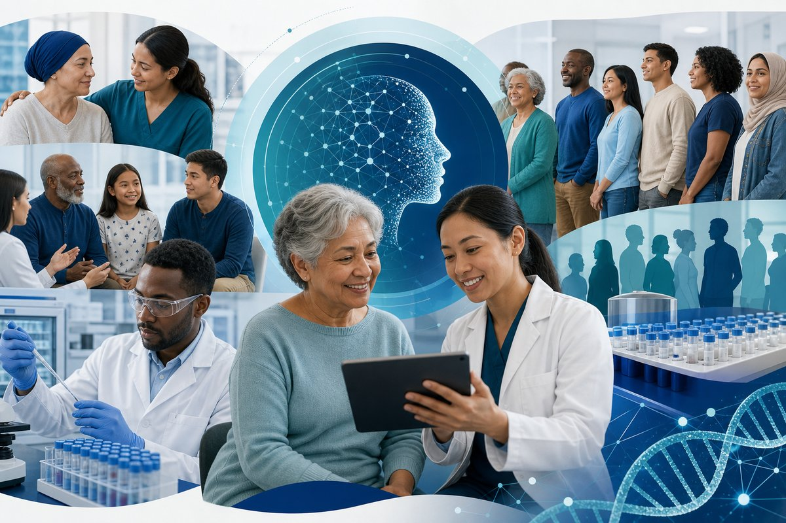

```{=html}
<div class="home-page">
  <section class="home-hero">
    <div class="home-hero-bg" style="background-image: url('images/projects/clinical-trial-patient-matching.jpg');"></div>
    <div class="home-hero-overlay"></div>
    <div class="home-hero-content">
      <p class="home-eyebrow">Yale School of Medicine · Yale Cancer Center</p>
      <h1 class="home-headline">AI for oncology trials, real-world evidence, and precision cancer care</h1>
      <p class="home-lead">We build clinical informatics and machine learning systems that match patients to trials, structure eligibility at scale, and turn EHR data into actionable research.</p>
      <div class="home-cta">
        <a class="home-btn home-btn-primary" href="research.html">Explore research</a>
        <a class="home-btn home-btn-secondary" href="projects.html">View projects</a>
      </div>
    </div>
  </section>

  <section class="home-stats">
    <div class="home-stat">
      <span class="home-stat-value">30+</span>
      <span class="home-stat-label">Oncology trials validated with CTPM</span>
    </div>
    <div class="home-stat">
      <span class="home-stat-value">53K+</span>
      <span class="home-stat-label">Trials analyzed for eligibility intelligence</span>
    </div>
    <div class="home-stat">
      <span class="home-stat-value">OMOP · ML · NLP · LLM</span>
      <span class="home-stat-label">Hybrid AI pipelines on real-world EHR data</span>
    </div>
  </section>

  <section class="home-section">
    <div class="home-section-header">
      <h2>Research focus</h2>
      <p>Four interconnected areas where we develop methods and deploy them in cancer care.</p>
    </div>
    <div class="home-grid">
      <a class="home-card" href="projects.html">
        
        <div class="home-card-body">
          <h3>Clinical trial patient matching</h3>
          <p>Real-time OMOP-based prescreening across structured and unstructured EHR data.</p>
        </div>
      </a>
      <a class="home-card" href="projects.html">
        
        <div class="home-card-body">
          <h3>Eligibility criteria intelligence</h3>
          <p>NLP and LLM pipelines to structure, cluster, and visualize trial criteria at scale.</p>
        </div>
      </a>
      <a class="home-card" href="projects.html">
        
        <div class="home-card-body">
          <h3>Real-world data &amp; EHR science</h3>
          <p>Computational phenotyping, data integrity, and predictive modeling for research.</p>
        </div>
      </a>
      <a class="home-card" href="projects.html">
        
        <div class="home-card-body">
          <h3>Equitable trial access</h3>
          <p>Methods designed to reach underserved and underrepresented patient populations.</p>
        </div>
      </a>
    </div>
  </section>

  <section class="home-section home-section-alt">
    <div class="home-split">
      <div class="home-split-text">
        <h2>From methods to impact</h2>
        <p>Led by <a href="people.html">Guannan Gong, PhD</a>, the lab integrates electronic health records, clinical NLP, large language models, and trial evidence synthesis. Our research informs <a href="https://www.ctrltrial.com/">CtrlTrial</a>—translating lab work into tools for real-time clinical trial recruitment at Yale and beyond.</p>
        <ul class="home-highlights">
          <li><strong>2026</strong> — CTPM validated across 29 oncology trials (<em>JCO Clinical Cancer Informatics</em>)</li>
          <li><strong>2026</strong> — Underrepresentation study across three NCI-designated cancer centers (<em>JCO Oncology Advances</em>)</li>
          <li><strong>2025</strong> — Blavatnik Accelerator Award for AI-powered trial matching</li>
        </ul>
      </div>
      <div class="home-split-visual">
        
      </div>
    </div>
  </section>

  <section class="home-affiliations">
    <span>Affiliations</span>
    <a href="https://medicine.yale.edu/">Yale School of Medicine</a>
    <a href="https://www.yalecancercenter.org/">Yale Cancer Center</a>
    <a href="https://cbb.yale.edu/">Computational Biology &amp; Biomedical Informatics</a>
  </section>
</div>
```
