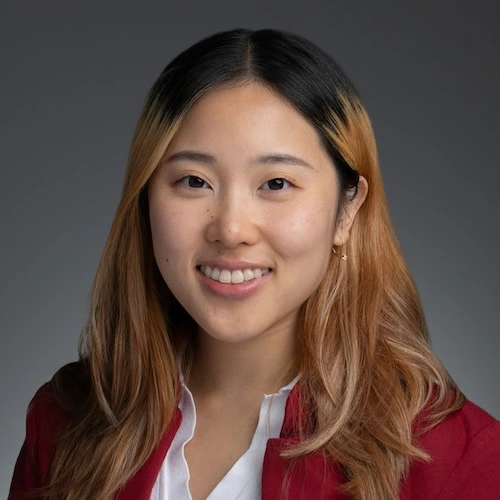

## Principal Investigator

::: {.grid .person-profile}
::: {.g-col-12 .g-col-md-3}
{.person-photo width=100% alt="Guannan Gong, PhD"}
:::

::: {.g-col-12 .g-col-md-9}
### Guannan Gong, PhD

**Associate Research Scientist**  
Department of Medical Oncology and Hematology  
Yale School of Medicine · Yale Cancer Center

Guannan Gong leads research at the intersection of clinical informatics, artificial intelligence, and oncology. His work focuses on digital phenotyping from electronic health records, clinical trial patient matching, and scalable NLP methods for structuring trial eligibility criteria. He is the founder of [CtrlTrial](https://www.ctrltrial.com/), which translates lab research into tools for real-time clinical trial recruitment.

**Education**

- PhD, Computational Biology and Bioinformatics — Yale University (2021)
- MS, Computer Science — Columbia University (2009)

**Contact:** [guannan.gong@yale.edu](mailto:guannan.gong@yale.edu) · [Yale profile](https://medicine.yale.edu/profile/guannan-gong/) · [ORCID 0000-0002-4972-6705](https://orcid.org/0000-0002-4972-6705)
:::
:::

---

## Team

::: {.grid .person-profile}
::: {.g-col-12 .g-col-md-3}
{.person-photo width=100% alt="Jessica Liu"}
:::

::: {.g-col-12 .g-col-md-9}
### Jessica Liu

**Postgraduate Associate**  
Yale Cancer Center  
Yale School of Medicine

Jessica Liu contributes to the Gong Lab's research on clinical trial patient matching, real-world evidence, and oncology informatics. Her work supports development and evaluation of the Clinical Trial Patient Matching (CTPM) system, real-time EHR data pipelines, and related digital oncology initiatives at Yale Cancer Center.

**Contact:** [jessica.liu.jl3722@yale.edu](mailto:jessica.liu.jl3722@yale.edu) · [Yale profile](https://medicine.yale.edu/profile/jessica-liu-jl3722/)
:::
:::

---

## Alumni

We are grateful to former students and trainees who contributed to Gong Lab research during their time at Yale.

- **Justin Xie** — Yale College; clinical trial eligibility criteria NLP framework (*JMIR Research Protocols*, 2026)
- **Jeet Parikh** — Yale College; clinical trial eligibility criteria NLP framework (*JMIR Research Protocols*, 2026)
- **Sameer Pandya** — Data Scientist; clinical trial patient matching and real-world EHR data informatics
