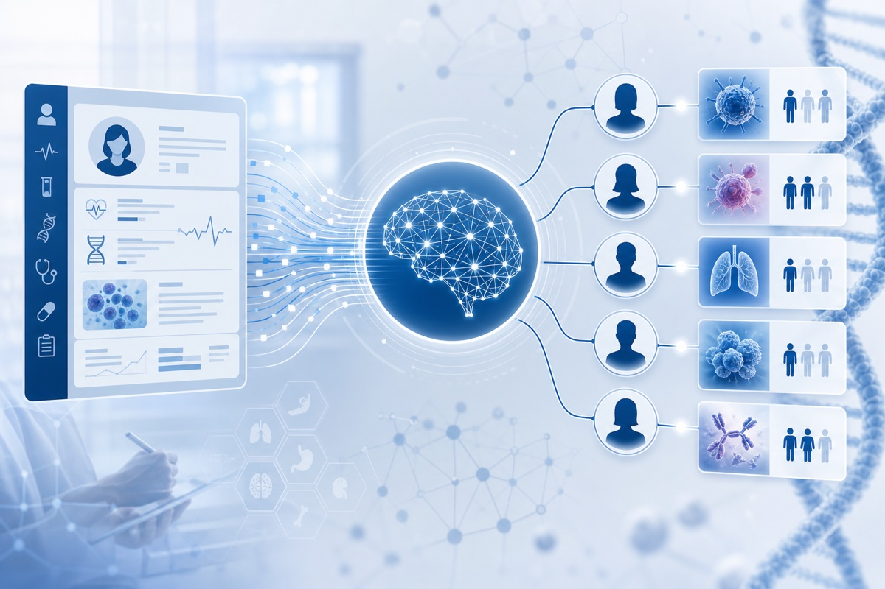
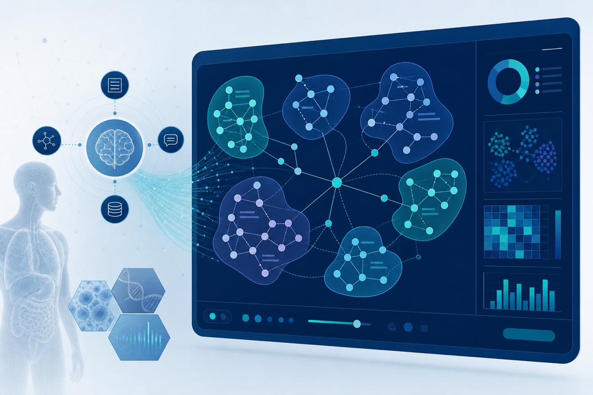

The Gong Lab leads and contributes to AI and informatics projects spanning clinical trial matching, real-world evidence, cancer equity, and digital oncology. Below are active and recent research initiatives.

## Clinical Trial Patient Matching (CTPM) / [CtrlTrial](https://www.ctrltrial.com/)

::: {.grid .project-profile}
::: {.g-col-12 .g-col-md-4}
{.project-image width=100% alt="Clinical Trial Patient Matching system"}
:::

::: {.g-col-12 .g-col-md-8}
**CTPM** is our flagship research platform for semiautomated prescreening of cancer patients against open clinical trials. **[CtrlTrial](https://www.ctrltrial.com/)** is the same technology, translated from Yale research into health system practice—founded by Dr. Gong to deploy AI-driven trial matching at scale.

**What it does**

- Ingests structured and unstructured EHR data via the OMOP common data model
- Applies hybrid rules-based and NLP logic to evaluate inclusion/exclusion criteria
- Delivers real-time feasibility assessments and patient-trial match lists
- Prescreens patients from Epic and integrated clinical, pathology, laboratory, and CTMS systems
- Notifies clinicians and trial teams when patients become eligible
- Scales across trials, cancer types, and health system deployments

**Related work**

- Catchment-area deployment to reduce enrollment disparities in the Yale Cancer Center catchment area
- ImPACCT: improving participation in cancer clinical trials among underrepresented patients
- Prospective evaluation in hematologic malignancies (MDS and multiple myeloma)
- Retrospective demographic studies of trial underrepresentation across NCI-designated cancer centers

Developed through Yale research programs and Yale Tsai CITY entrepreneurship initiatives, with pilot validation at Yale New Haven Health. Supported by Yale Cancer Center T-TARE, YNHH Innovation Awards, Blavatnik Accelerator Award, Yale Cancer Center Catchment Area Research Award, Rothberg Catalyzer Prize, and Connecticut Innovations BioPipeline Award.

[Read the 2026 publication →](publications.qmd) · [Visit CtrlTrial →](https://www.ctrltrial.com/)
:::
:::

---

## Eligibility Criteria Visualizer

::: {.grid .project-profile}
::: {.g-col-12 .g-col-md-4}
{.project-image width=100% alt="Eligibility Criteria Visualizer"}
:::

::: {.g-col-12 .g-col-md-8}
An NLP framework for structuring and exploring clinical trial eligibility criteria at scale.

**Approach**

1. Unsupervised clustering of semantically similar criteria from trial protocols
2. LLM-based summarization of criteria clusters
3. Interactive visualization of patterns by disease domain and over time

The prototype analyzed **53,000+ oncology trials** from ClinicalTrials.gov. Open-source tools are available via the [CriteriaVisualizer repository](https://github.com/ctrltrial/CriteriaVisualizer).

Supported by the Yale New Haven Health Innovation Award.

[Read the study protocol →](https://www.researchprotocols.org/2026/1/e86425)
:::
:::

---

## LEAD-ONC & evidence-driven trial design

An AI-assisted framework for automated extraction and harmonization of clinical trial data from oncology literature (**LEAD-ONC**), combined with **Learning from Literature** — integrating LLMs and Bayesian hierarchical modeling to inform oncology trial design from published evidence.

**Goals**

- Digitize and harmonize trial endpoints, arms, and outcomes from the literature
- Support Bayesian evidence synthesis for trial planning
- Bridge clinical trial registries, literature, and real-world data for design decisions

Related pending work includes NIH-funded integration and digitalization of clinical trial registries and literature for evidence synthesis.

[LEAD-ONC preprint →](https://doi.org/10.48550/arXiv.2602.08172) · [Learning from Literature (in press) →](publications.qmd)

---

## Real-time EHR data integrity

::: {.grid .project-profile}
::: {.g-col-12 .g-col-md-4}
{.project-image width=100% alt="Real-time EHR data integrity project"}
:::

::: {.g-col-12 .g-col-md-8}
A collaborative project with the Schulz Lab assessing whether real-time EHR extracts meet the quality standards required for clinical research—benchmarking latency, completeness, and accuracy against research-grade datasets.

This work underpins all CTPM and real-world evidence pipelines that rely on live EHR feeds.

[Publication →](https://pubmed.ncbi.nlm.nih.gov/41511976/)
:::
:::

---

## Digital oncology & real-world evidence

AI-driven quality improvement and real-world evidence studies in breast and prostate oncology.

**QI-ATIR** — An AI tool for automatically identifying high-risk recurrence in HR+, HER2− early breast cancer patients, supporting quality improvement in adjuvant therapy decisions. With Maryam Lustberg, MD, MPH.

**BID CAP** — A bidirectional communication tool to optimize adherence and persistence to CDK4/6 inhibitors in HR+/HER2− breast cancer. PI for Yale subaward.

**CDK4/6 persistence studies** — Real-world analyses of treatment persistence, area deprivation index associations, and concept-mapping strategies to improve adherence. Presented at NCCN, AACR, and HOPA.

**Biomarker and genomic testing in prostate cancer** — Identifying gaps and implementing quality improvement solutions for biomarker and genomic testing. With William K. Oh, MD.

Supported by Eli Lilly, ASCO, and Pfizer.

---

## Cancer equity & trial access

Research focused on equitable access to clinical trials, genetic testing, and biobanking.

**AI-assisted navigation for hereditary breast cancer testing** — Mitigating disparities in genetic testing access through AI-assisted patient navigation. With Tracy A. Battaglia, MD, MPH (Susan G. Komen Foundation).

**BRIDGE** — Assessing biobanking representation, integration, and diversifying community engagement in cancer care equity research. With Shilpa Murthy, MD, MPH.

**ImPACCT** — Improving participation in cancer clinical trials by addressing provider and patient barriers to enrollment among underrepresented groups. With Andrea Silber, MD (ASCO).

**CTPM catchment-area disparities** — Deploying AI-based patient matching to identify and reduce enrollment disparities in the Yale Cancer Center catchment area.

---

## Precision medicine & genetics informatics

**INSPIRE 2.0 genetics database** — Establishment and completion of a genetics database for the Yale Cancer Center catchment area. With Veda Giri, MD and Nancy Borstelmann, PhD, MPH.

**DOD ENGAGEMENT study** — Leveraging AI to develop a genetics database of clinical and genetic factors to inform cancer risks and cascade testing in families.

**Early-onset breast cancer cohort** — Clinical, genetic, family history, and reproductive differences in early- versus late-onset breast cancer in a diverse cohort.

---

## Adaptive education & emerging initiatives

**AI-powered adaptive education platform** — Optimizing first-line maintenance therapy education for HER2+ metastatic breast cancer (Pfizer).

**AI-enabled clinical trial registry integration** — Pending NIH award to integrate and digitize clinical trial registries and literature for evidence synthesis and trial design. With Wei Wei as Co-PI.

---

## Research informatics infrastructure

We contribute to Yale-wide informatics initiatives including:

- Patient recruitment workflows connecting primary care providers through the EMR and patient portal
- Real-time specimen identification for collaborative biobanking
- Computational phenotyping pipelines for precision medicine
- Blockchain-based data integrity validation (TrialChain)

These projects build on Dr. Gong's experience at Epic Systems, InterSystems, the Yale/YNHH Center for Outcomes Research and Evaluation (CORE), and over a decade of health IT development prior to joining Yale School of Medicine.
